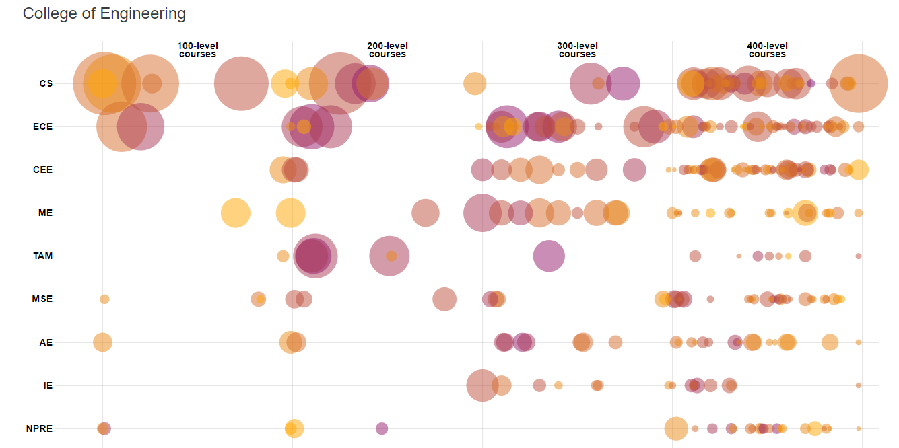

# X-Team 122 Project Proposal

See https://github.com/adam-p/markdown-here/wiki/Markdown-Cheatsheet#code for tips on using *Markdown* tags to format __.md__ files

## Goal

Work as a team to create a project proposal for your X-team to complete together.
The project does not have to be extremely difficult,
but there must be work to do for each member of your team.
You may reference figures using "See figure 1".  
Be sure to submit corresponding image files, i.e. figure1.png (or figure1.jpg) for each figure.

## Grading: To earn full credit, your team's proposal must include:

* (md) documentation: [this file] describing purpose and use of your program

* Description of a program that has:

  ** a main Java program class in a file named Main.java
  
  ** a custom data structure designed and built by your team
  
  ** comprehensive testing of individual units
  
 Caution: You are not being asked to implement this program, at least not yet. 
 We just want your group to make a proposal or pitch for your program.
 
 Tip: Your custom data structure can be composed of or extensions of data structures that you have learned and used in previous programming assignments.  We're looking for decisions about how to build a high-level data structure that will likely have lower-level components.

## Problem Description

Briefly describe a problem that your team would like to solve.  
Describe at a high level a program that could solve that problem.

- Our X-Team would like to visualize the grades that UW Madison students got in certain classes at the university in a clean and comprehensive way.

- Our program will take an input of letter grades of certain courses available at the University of Wisconsin Madison. The program will then take those inputs and rearrange them into a more comprehensible way in order to make the data more visually understandable. 

- Personal note (Jaskirat Singh): When Aska brought up the idea of a GPA calculator, Paul thought about various grade calculators similar to Rogerhub.com that calculate final scores. However, if we want to utilize the full power of data structures, I thought of a very big project done at UIUC, my previous university, by my previous data structures professor. He reformatted public information to show which professors tend to have lower or higher distributions. The university, the students, and the staff all use the information every year as it is easy to read and comprehensive. He mentioned that he used graphs to create this, and I believe we can use our new knowledge of data structures to make something as useful for Madison. 

## Questions to answer for Exercise #2

<table>
 <tr>
   <td>1. Name: Give your project proposal a name (and edit the top line of this file)
  <ul><li> GPA Visualizer</li></ul>
  </td>
  </tr>
  <tr>
    <td>2. Output: Describe the output your program will produce.  Include and example format of the output produced.
   <ul><li> The program will output a bubble chart of GPA distribution. See Figure 1:</li></ul>
   </td>
  </tr>
 <tr>
  <td> 

 </td>
    <tr>
    <td>3. Input: Describe the data that is needed to solve your problem. Include an example format of the input data.
 <ul><li> The data we will be inputting to solve our problem is public information on the grade distribution. 
   This data is provided at this link: https://registrar.wisc.edu/wp-content/uploads/sites/36/2018/02/report-gradedistribution-2017-2018fall.pdf and we will place this link under "figures referenced by this document." </li></ul>
 </td>
  </tr>
    <tr>
    <td>4. User Interface: Describe a user interface for your program.  Use text menus or a simple graphic user interface.
 <ul>    
  
<li>Input button:</li>
Name of the department 
Name of courses and the number of the courses 
Grades for the courses 
Number of the students who take the course
<li>Output:</li>
Graph
</ul>
 </td>
  </tr>
    <tr>
    <td>5. Types List: Break your solution idea down into units that you think can be implemented with a single class.
 <ul><li> We would need a way to read the pdf provided for FA18 and interpret those results into our data structure. So a reader may need to be designed in the event that we cannot find a third party PDF reader that works. </li></ul>
 <ul><li> We need a class that sorts the data provided by the reader into the proper data structures. The data structure will most likely be a graph with weights to show different GPA values for different classes. Then, users can see distributions.  </li> <li> we need class to create the output graph</li> 
<li> we need a test class to test the storage class</li> 
<li> we need a test class to test the graph class</li> 
     </ul>
 </td>
  </tr>
    <tr>
    <td>Name each interface or class and briefly describe its function or purpose.
     <ul><li> GraphADT, the interface for the graph class</li></ul>
     <ul><li> Graph Class, creates the output graph from the input grades and classes</li></ul>
     <ul><li> GradesList Class, a class that stores the grades for the specified courses that are input</li></ul>
     <ul><li> Main Class, a class that would take in the inputs and turn them into a graph then output the graph</li></ul>
     <ul><li> TestGraph class, a class that tests the functionality of the graph class, makes sure that the graph that is output is correct</li></ul>
     <ul><li> TestGradesList Class, a class that tests the functionality of the GradesList class, makes sure grades are stored correctly</li></ul>
     
 </td>
  </tr>
</table>

## Edit and Submit this file and any figures referenced by this document.
https://registrar.wisc.edu/wp-content/uploads/sites/36/2018/02/report-gradedistribution-2017-2018fall.pdf
http://waf.cs.illinois.edu/discovery/gpa_of_every_course_at_illinois/
